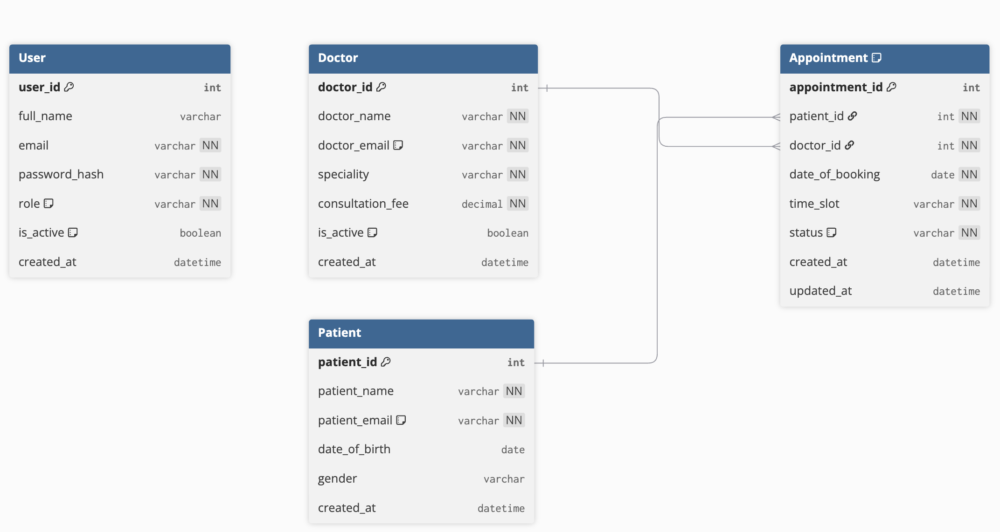

# Hospital Management System


A **DBMS-focused Hospital Management System** built using **Flask** and **SQLite**.  
The project demonstrates how a relational database can be used to manage **users, doctors, patients, and appointments** through a simple web interface.

This application is designed to highlight:

- **relational database design**
- **entity relationships**
- **constraints and validation**
- **CRUD operations**
- **role-based access**
- **appointment lifecycle management**

---

## Table of Contents

- [Overview](#overview)
- [Key Highlights](#key-highlights)
- [Technology Stack](#technology-stack)
- [Database Design Focus](#database-design-focus)
- [Core Modules](#core-modules)
- [Application Routes / Endpoints](#application-routes--endpoints)
- [Database Schema Summary](#database-schema-summary)
- [Entity Relationship Diagram (ERD)](#entity-relationship-diagram-erd)
- [Business Rules Implemented](#business-rules-implemented)
- [Project Structure](#project-structure)
- [How to Run the Project](#how-to-run-the-project)
- [How to Use the Application](#how-to-use-the-application)
- [Sample Data Guide](#sample-data-guide)
- [Database Reset Guide](#database-reset-guide)
- [Current Constraints](#current-constraints)
- [Future Scope](#future-scope)
- [Conclusion](#conclusion)

---

## Overview

This project is a **Hospital Management System** developed primarily as a **DBMS academic project**.  
The web application layer is intentionally simple, while the database layer is the central part of the system.

The application manages four key entities:

- **User**
- **Doctor**
- **Patient**
- **Appointment**

It supports **three user roles**:

- **Admin**
- **Doctor**
- **Patient**

Each role gets access to different parts of the system through **role-based dashboards**.

---

## Key Highlights

- User registration and login with password hashing
- Role-based access for Admin, Doctor, and Patient
- Doctor profile creation and update
- Patient profile creation and update
- Appointment booking with validation
- Admin appointment management:
  - cancel
  - complete
  - reschedule
- Database viewer for inspecting stored records
- Sample data loader for quick demo/testing
- SQLite-backed relational schema with constraints and foreign keys

---

## Technology Stack

| Layer | Technology |
|---|---|
| Backend | Flask |
| Database | SQLite |
| Frontend | HTML, CSS, Jinja2 Templates |
| Authentication | Flask Sessions + Werkzeug Password Hashing |
| Language | Python |

---

## Database Design Focus

This project is primarily a **DBMS project**, and that is reflected in the schema and workflows.

### DBMS concepts demonstrated

- **Entity design**
  - `User`
  - `Doctor`
  - `Patient`
  - `Appointment`

- **Relationships**
  - one doctor can attend many appointments
  - one patient can book many appointments

- **Constraints**
  - unique email values
  - unique doctor/date/time-slot appointment combinations
  - role restrictions
  - appointment status restrictions
  - foreign key integrity

- **Operations**
  - insert new records
  - update profile data
  - book appointments
  - reschedule appointments
  - cancel/complete appointments
  - read records role-wise and table-wise

---

## Core Modules

### 1. Authentication Module
Handles:

- user registration
- user login
- logout
- password hashing
- session creation

### 2. Doctor Module
Handles:

- doctor profile creation/update
- viewing doctor appointments
- dashboard-level statistics

### 3. Patient Module
Handles:

- patient profile creation/update
- booking appointments
- viewing appointment history
- dashboard-level statistics

### 4. Admin Module
Handles:

- viewing overall hospital data
- viewing all appointments
- cancelling appointments
- completing appointments
- rescheduling appointments

### 5. Database Initialization and Seeding
Handles:

- creating tables
- enforcing schema rules
- loading demo/sample data

---

## Application Routes / Endpoints

### Public Routes

| Endpoint | Method | Purpose |
|---|---|---|
| `/` | GET | Redirects to login |
| `/database` | GET | Displays database records for demo/inspection |

### Authentication Routes

| Endpoint | Method | Purpose |
|---|---|---|
| `/auth/register` | GET, POST | Register a new user |
| `/auth/login` | GET, POST | Login to the system |
| `/auth/logout` | GET | Logout current user |
| `/auth/dashboard` | GET | Redirect to role-specific dashboard |

### Doctor / Patient Profile Routes

| Endpoint | Method | Purpose |
|---|---|---|
| `/auth/update-doctor-profile` | GET, POST | Create/update doctor profile |
| `/auth/update-patient-profile` | GET, POST | Create/update patient profile |

### Appointment Routes

| Endpoint | Method | Purpose |
|---|---|---|
| `/auth/book-appointment` | POST | Book a new appointment |
| `/auth/admin/complete-appointment/<appointment_id>` | POST | Mark appointment as completed |
| `/auth/admin/cancel-appointment/<appointment_id>` | POST | Cancel appointment |
| `/auth/admin/reschedule-appointment/<appointment_id>` | POST | Reschedule appointment |

### Dashboard Views

| Role | Access |
|---|---|
| Admin | Admin dashboard |
| Doctor | Doctor dashboard |
| Patient | Patient dashboard |

---

## Database Schema Summary

### `User`
Stores authentication and role information.

**Fields**
- `user_id` (Primary Key)
- `full_name`
- `email` (Unique)
- `password_hash`
- `role`
- `is_active`
- `created_at`

### `Doctor`
Stores doctor-specific profile information.

**Fields**
- `doctor_id` (Primary Key)
- `doctor_name`
- `doctor_email` (Unique)
- `speciality`
- `consultation_fee`
- `is_active`
- `created_at`

### `Patient`
Stores patient-specific profile information.

**Fields**
- `patient_id` (Primary Key)
- `patient_name`
- `patient_email` (Unique)
- `date_of_birth`
- `gender`
- `created_at`

### `Appointment`
Stores appointment relationships between doctors and patients.

**Fields**
- `appointment_id` (Primary Key)
- `patient_id` (Foreign Key)
- `doctor_id` (Foreign Key)
- `date_of_booking`
- `time_slot`
- `status`
- `created_at`
- `updated_at`

---

## Entity Relationship Diagram (ERD)

### ERD Overview

- A **Patient** can book multiple **Appointments**
- A **Doctor** can attend multiple **Appointments**
- `User` manages authentication and role access
- `Admin` exists through the `role` column in `User`
- `Doctor` and `Patient` are linked to `User` through email in the current implementation

### dbdiagram.io ERD
<p>
  
</p>

---

## Business Rules Implemented

The following rules are enforced through the database design and backend logic:

- Each user email must be unique
- Each doctor email must be unique
- Each patient email must be unique
- User role must be valid
- Appointment status must be valid
- A doctor cannot be double-booked for the same date and time slot
- A patient cannot hold two appointments at the same time
- Appointments cannot be booked for past dates
- Rescheduled appointments are validated before updating
- Only authorized roles can access protected dashboards and actions

---

## Project Structure

```text
hms/
│
├── app.py
├── auth.py
├── db.py
├── sql_init.py
├── seed_sample_data.py
├── hospital_management.db
├── requirements.txt
├── README.md
│
└── src/
    ├── static/
    │   └── styles.css
    ├── templates/
    │   ├── base.html
    │   ├── login.html
    │   ├── register.html
    │   ├── dashboard.html
    │   ├── doctor.html
    │   ├── patient.html
    │   ├── admin.html
    │   └── database.html
    ├── tests/
    └── utils/
```

---

## How to Run the Project

### 1. Move into the project folder

```bash
cd hms
```

### 2. Create a virtual environment

**macOS / Linux**
```bash
python3 -m venv .venv
source .venv/bin/activate
```

**Windows**
```bash
python -m venv .venv
.venv\Scripts\activate
```

### 3. Install dependencies

```bash
pip install -r requirements.txt
```

### 4. Initialize the database

```bash
python sql_init.py
```

### 5. Load sample data (optional but recommended)

```bash
python seed_sample_data.py
```

### 6. Run the application

```bash
python app.py
```

The app usually runs at:

```text
http://127.0.0.1:5000
```

---

## How to Use the Application

### 1. Register
Go to:

```text
http://127.0.0.1:5000/auth/register
```

Fill in:

- full name
- email
- role
- password
- confirm password

### 2. Login
Go to:

```text
http://127.0.0.1:5000/auth/login
```

Enter your email and password.

### 3. Patient Workflow
As a patient, you can:

1. login
2. complete your patient profile
3. view doctors
4. book appointments
5. track appointment status

### 4. Doctor Workflow
As a doctor, you can:

1. login
2. complete your doctor profile
3. view appointment list
4. track appointment statistics

### 5. Admin Workflow
As an admin, you can:

1. login
2. open admin dashboard
3. inspect users, doctors, patients, and appointments
4. cancel appointments
5. complete appointments
6. reschedule appointments

---

## Sample Data Guide

After running:

```bash
python seed_sample_data.py
```

sample records are inserted into the database for demonstration and testing.

### Default seeded credentials

**Admin**
- Email: `admin@hms.com`
- Password: `Password@123`

> The same password may be used for the other seeded sample users depending on the seeding script configuration.

Sample data helps in:

- dashboard demonstration
- testing appointment workflows
- DBMS project presentation
- verifying table relationships and constraints

---

## Database Reset Guide

### Option 1: Delete the database file and recreate it

**macOS / Linux**
```bash
rm hospital_management.db
python sql_init.py
python seed_sample_data.py
```

**Windows**
```bash
del hospital_management.db
python sql_init.py
python seed_sample_data.py
```

### Option 2: Delete table data manually

```sql
DELETE FROM Appointment;
DELETE FROM Doctor;
DELETE FROM Patient;
DELETE FROM User;
```

Delete `Appointment` first because of foreign key dependencies.

---

## Current Constraints

This version is designed for **demonstration and DBMS learning**, so the focus is on schema design, relationships, and workflows rather than enterprise-scale production features. The UI is intentionally simple, and some advanced hospital workflows remain out of scope for the current version.

---